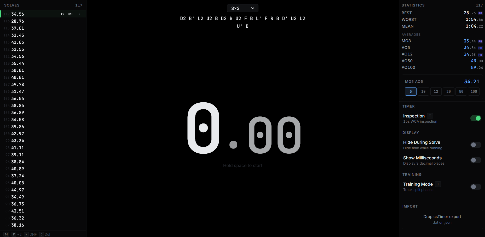
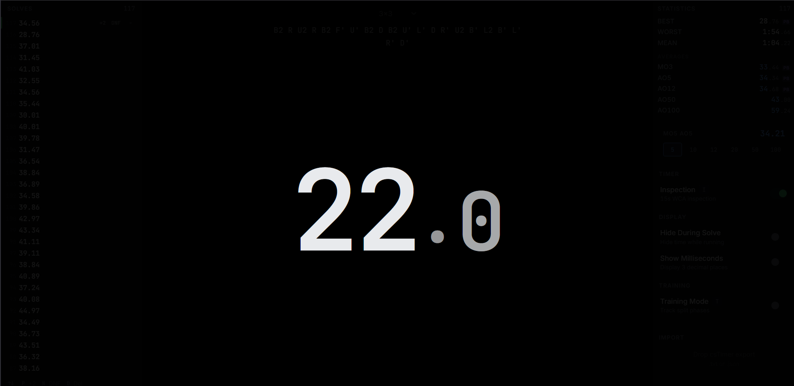
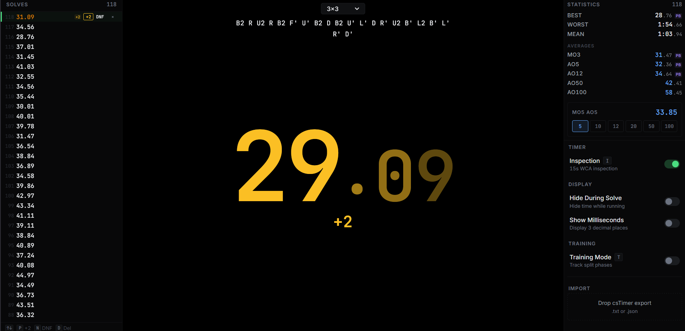

# KubeTimr

A keyboard-first, offline-first cube timer for serious speedcubers. Cleaner than CSTimer, focused on precision and flow.

## Screenshots

<table>
  <tr>
    <td align="center">
      
      <br/><em>Main Screen</em>
    </td>
    <td align="center">
      
      <br/><em>Inspection Time</em>
    </td>
  </tr>
  <tr>
    <td align="center">
      
      <br/><em>Solving Time</em>
    </td>
    <td align="center">
      
      <br/><em>Result</em>
    </td>
  </tr>
</table>

Built by cubers, for cubers. No accounts, no cloud sync, no ads. Just timing.

## Features

### Core Timer
- High-precision timing using `performance.now()` for microsecond accuracy
- CSTimer-style spacebar interaction: hold to ready, release to start, press to stop
- WCA inspection support: configurable 15-second countdown with +2/DNF penalties
- Visual state feedback: clear color changes for idle, inspection, running, and stopped states

### Scramble Generation
- All WCA events supported: 2×2 through 7×7, Pyraminx, Skewb, Square-1, Clock, Megaminx
- Seeded random-state scrambles for reproducibility
- Extensible architecture for adding non-WCA puzzles

### Statistics
- Rolling averages: Mo3, Ao5, Ao12, Ao50, Ao100, Ao1000
- Best, worst, and session mean
- MoXAo5: Configurable mean-of-X average-of-5
- Personal best detection and highlighting

### Training Mode
- Configurable split phases: define your own method phases
- Presets for popular methods: CFOP, Roux, ZZ, Petrus
- Real-time split marking during solves
- Post-solve breakdown with per-phase durations and percentages

### Data Management
- Offline-first: all data stored locally via IndexedDB or localStorage
- CSTimer import support (.txt exports only)
- Session-based solve organization
- No network calls, no cloud sync, no accounts

## Keyboard Shortcuts

### Timer
| Key | Action |
|-----|--------|
| `Space` (hold) | Ready timer |
| `Space` (release) | Start timer or inspection |
| `Space` (during solve) | Stop timer |

### Navigation
| Key | Action |
|-----|--------|
| `↑` / `K` | Navigate up in solve list |
| `↓` / `J` | Navigate down in solve list |
| `2` | Toggle +2 penalty |
| `D` | Toggle DNF penalty |
| `0` | Clear penalty |
| `Enter` | Select solve |
| `Del` / `Backspace` | Delete selected solve |

### Controls
| Key | Action |
|-----|--------|
| `R` | Generate new scramble |
| `I` | Toggle inspection |
| `T` | Toggle training mode |
| `E` | Edit split phases (training mode) |
| `F` | Toggle fullscreen |
| `Esc` | Exit fullscreen or close modal |

## Getting Started

### Prerequisites
- Node.js 18+
- npm or yarn

### Installation

```bash
git clone https://github.com/yourusername/kubetimr.git
cd kubetimr
npm install
npm run dev
```

### Building for Production

```bash
npm run build
npm run preview
```

## Project Structure

```
src/
├── types.ts           # Core domain types
├── rng.ts             # Deterministic PRNG for scrambles
├── timingEngine.ts    # High-res timing state machine
├── scrambleEngine.ts  # Scramble generation for all events
├── statsEngine.ts     # Statistics computation
├── splits.ts          # Training split utilities
├── persistence.ts     # IndexedDB/localStorage adapter
├── main.tsx           # React entry point
└── ui/
    ├── App.tsx        # Main application component
    ├── AppContext.tsx # Global state management
    ├── hooks/
    │   └── useTimer.ts
    └── components/
        ├── TimerDisplay.tsx
        ├── ScrambleDisplay.tsx
        ├── StatsPanel.tsx
        ├── SolveList.tsx
        ├── Settings.tsx
        ├── SplitEditor.tsx
        ├── SplitMarkers.tsx
        └── SplitBreakdown.tsx
```

## Design Principles

1. **Keyboard-first**: Everything usable without a mouse.
2. **Zero friction**: No modals, no onboarding, no interruptions.
3. **Instant feel**: Optimized for low-end devices.
4. **Privacy by default**: No accounts, no tracking, no network calls.

## License

MIT License — see [LICENSE](LICENSE) for details.